# USER STORIES Y BACKLOG DE PRODUCTO - LTI
**Lean Talent Intelligence - Sistema ATS con IA para roles de IA/ML**

---

## ROLES Y PERSONAS

### Roles Principales:
- **Hiring Manager (HM)**: Responsable de definir requisitos del puesto y tomar decisiones de contratación
- **Reclutador Técnico (RT)**: Especialista en sourcing y evaluación inicial de candidatos técnicos
- **Candidato (C)**: Profesional de IA/ML que aplica a posiciones

---

## USER STORIES POR ÉPICAS

### 🔑 ÉPICA 1: GESTIÓN DE ACCESO Y CONFIGURACIÓN INICIAL
**Prioridad: MUST HAVE**

#### US-001: Autenticación de Usuario
**Como** Hiring Manager o Reclutador Técnico,  
**quiero** poder iniciar sesión de forma segura en la plataforma  
**para** acceder a las funcionalidades del ATS y gestionar el proceso de contratación.

**Criterios de Aceptación:**
- Login con email y contraseña
- Recuperación de contraseña
- Sesión persistente con logout seguro

**Diagrama de Caso de Uso:**
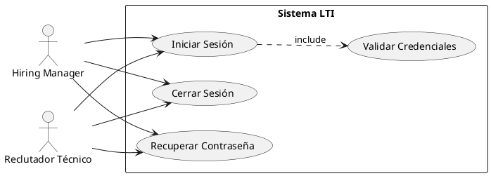

---

#### US-002: Dashboard Principal
**Como** Hiring Manager o Reclutador Técnico,  
**quiero** ver un dashboard con métricas clave y acceso rápido a funcionalidades principales  
**para** tener una visión general del estado de mis procesos de contratación.

**Criterios de Aceptación:**
- Vista de ofertas activas
- Métricas de candidatos por oferta
- Acceso rápido a crear nueva oferta
- Notificaciones pendientes

**Diagrama de Caso de Uso:**
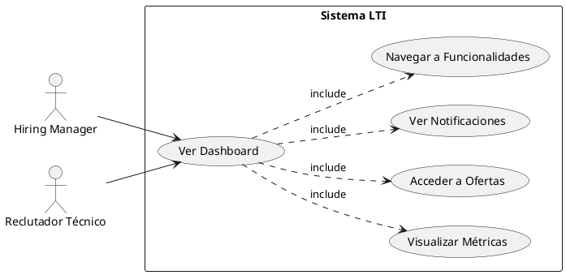

---

### 🎯 ÉPICA 2: GESTIÓN INTELIGENTE DE OFERTAS DE EMPLEO
**Prioridad: MUST HAVE**

#### US-003: Crear Oferta con Análisis de IA
**Como** Hiring Manager,  
**quiero** crear una oferta de empleo y recibir un análisis inteligente de su atractivo y viabilidad  
**para** optimizar la descripción y atraer al mejor talento disponible.

**Criterios de Aceptación:**
- Formulario de creación de oferta con editor enriquecido
- Análisis automático de IA con score de atractivo
- Sugerencias de mejora basadas en datos del mercado
- Estimación de pool de talento disponible
- Guardado como borrador o publicación directa

**Diagrama de Caso de Uso:**
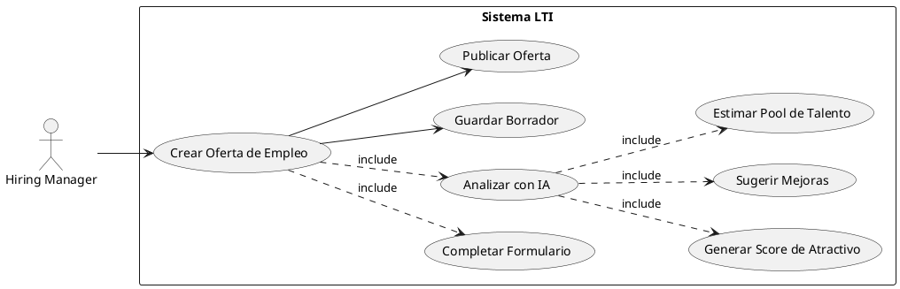

---

#### US-004: Gestión de Ofertas Activas
**Como** Reclutador Técnico,  
**quiero** visualizar y administrar todas las ofertas de empleo activas  
**para** hacer seguimiento del progreso y gestionar múltiples procesos simultáneamente.

**Criterios de Aceptación:**
- Lista de ofertas con filtros (estado, fecha, etc.)
- Vista detallada de cada oferta
- Cambio de estado (borrador, activa, cerrada)
- Métricas básicas por oferta (aplicaciones, entrevistas, etc.)

**Diagrama de Caso de Uso:**
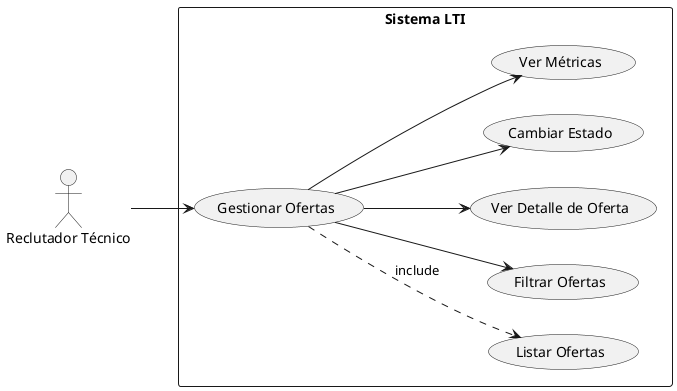

---

### 🤖 ÉPICA 3: MATCHING INTELIGENTE Y GESTIÓN DE CANDIDATOS
**Prioridad: MUST HAVE**

#### US-005: Aplicación de Candidato con Enriquecimiento Automático
**Como** Candidato,  
**quiero** aplicar a una oferta de empleo de manera sencilla  
**para** ser considerado para la posición y que mi perfil sea evaluado correctamente.

**Criterios de Aceptación:**
- Formulario de aplicación simple (CV + datos básicos)
- Enlace opcional a GitHub/LinkedIn
- Confirmación de recepción
- Estado de aplicación visible

**Diagrama de Caso de Uso:**
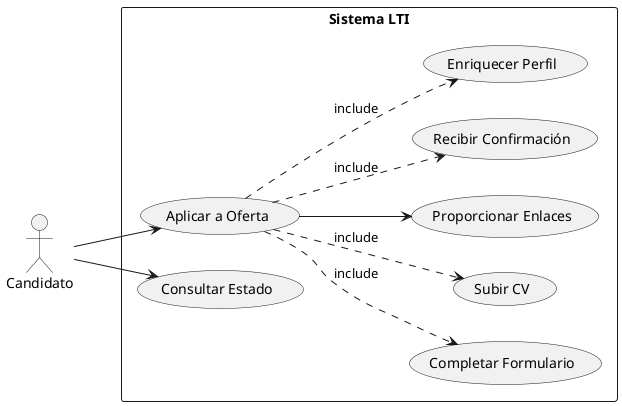

---

#### US-006: Criba Inteligente con IA
**Como** Reclutador Técnico,  
**quiero** ver candidatos automáticamente evaluados y enriquecidos por IA  
**para** realizar una criba inicial de alta calidad en segundos.

**Criterios de Aceptación:**
- Score de matching automático (0-100)
- Resumen inteligente de 3-5 puntos clave
- Perfil enriquecido con datos de GitHub (cuando disponible)
- Filtrado por score mínimo
- Acceso rápido al CV original

**Diagrama de Caso de Uso:**
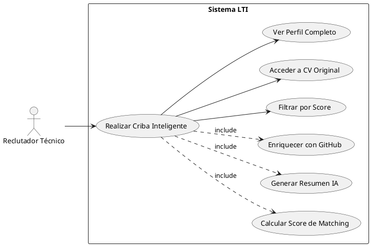

---

#### US-007: Gestión del Pipeline de Candidatos
**Como** Reclutador Técnico,  
**quiero** gestionar el estado de los candidatos a través del pipeline de selección  
**para** hacer seguimiento organizado del progreso de cada aplicación.

**Criterios de Aceptación:**
- Vista kanban del pipeline (Aplicado → Criba → Entrevista → Decisión)
- Cambio de estado por drag & drop
- Historial de cambios
- Filtros por estado y fechas

**Diagrama de Caso de Uso:**
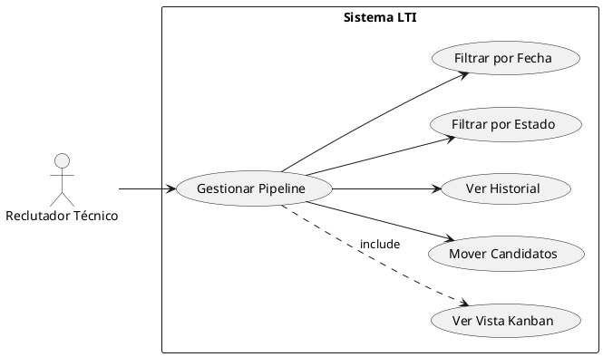

---

### 💬 ÉPICA 4: COLABORACIÓN Y FEEDBACK
**Prioridad: SHOULD HAVE**

#### US-008: Evaluación Colaborativa de Candidatos
**Como** Hiring Manager,  
**quiero** revisar candidatos preseleccionados y dejar feedback  
**para** colaborar eficientemente con el equipo de reclutamiento en la toma de decisiones.

**Criterios de Aceptación:**
- Vista detallada del perfil del candidato
- Sistema de rating (1-5 estrellas)
- Comentarios cualitativos
- Historial de feedback del equipo
- Notificaciones de nuevas evaluaciones

**Diagrama de Caso de Uso:**
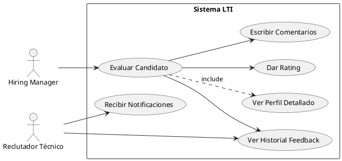

---

#### US-009: Comunicación Interna sobre Candidatos
**Como** Reclutador Técnico,  
**quiero** comunicarme con el Hiring Manager sobre candidatos específicos  
**para** alinear criterios y tomar decisiones informadas de manera ágil.

**Criterios de Aceptación:**
- Sistema de comentarios por candidato
- Menciones (@usuario)
- Notificaciones en tiempo real
- Historial de conversación

**Diagrama de Caso de Uso:**
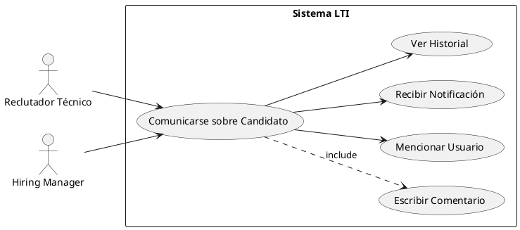

---

### 📊 ÉPICA 5: REPORTES Y MÉTRICAS
**Prioridad: COULD HAVE**

#### US-010: Métricas de Rendimiento del Proceso
**Como** Hiring Manager,  
**quiero** visualizar métricas clave del proceso de contratación  
**para** identificar cuellos de botella y optimizar la eficiencia del equipo.

**Criterios de Aceptación:**
- Tiempo promedio por fase del pipeline
- Ratio de candidatos por etapa
- Efectividad del matching de IA
- Exportación de reportes

**Diagrama de Caso de Uso:**
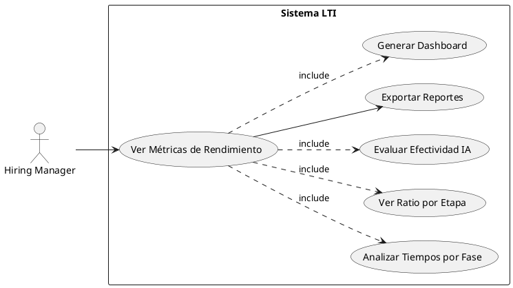

---

#### US-011: Análisis de Calidad de Candidatos
**Como** Reclutador Técnico,  
**quiero** analizar la calidad de los candidatos que recibo  
**para** ajustar las estrategias de sourcing y mejorar el targeting.

**Criterios de Aceptación:**
- Distribución de scores de matching
- Análisis de fuentes de candidatos
- Tendencias temporales
- Comparación entre ofertas

**Diagrama de Caso de Uso:**
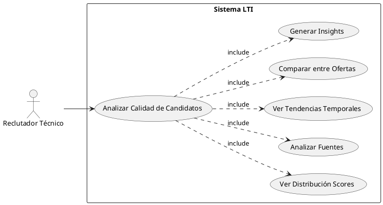

---

## 📋 BACKLOG PRIORIZADO

### Metodología de Priorización: **MoSCoW + Value vs Effort Matrix**

| Prioridad | ID | User Story | Valor de Negocio | Esfuerzo | Ratio V/E |
|-----------|-----|------------|------------------|----------|-----------|
| 🔴 MUST | US-001 | Autenticación de Usuario | Alto | Medio | 2.0 |
| 🔴 MUST | US-002 | Dashboard Principal | Alto | Medio | 2.0 |
| 🔴 MUST | US-005 | Aplicación de Candidato con Enriquecimiento | Muy Alto | Alto | 2.5 |
| 🔴 MUST | US-003 | Crear Oferta con Análisis de IA | Muy Alto | Alto | 2.5 |
| 🔴 MUST | US-006 | Criba Inteligente con IA | Muy Alto | Muy Alto | 2.0 |
| 🔴 MUST | US-004 | Gestión de Ofertas Activas | Alto | Medio | 2.0 |
| 🔴 MUST | US-007 | Gestión del Pipeline de Candidatos | Alto | Medio | 2.0 |
| 🟡 SHOULD | US-008 | Evaluación Colaborativa de Candidatos | Alto | Medio | 2.0 |
| 🟡 SHOULD | US-009 | Comunicación Interna sobre Candidatos | Medio | Medio | 1.5 |
| 🟢 COULD | US-010 | Métricas de Rendimiento del Proceso | Medio | Bajo | 2.5 |
| 🟢 COULD | US-011 | Análisis de Calidad de Candidatos | Medio | Bajo | 2.5 |

---

## 🎫 TICKETS DE TRABAJO (SPRINT 1)

### Sprint Goal: "Establecer la base del sistema con capacidades core de IA"

#### TICKET T-001: Sistema de Autenticación
**User Story:** US-001  
**Descripción:** Implementar sistema completo de login/logout con recuperación de contraseña

**Tareas Técnicas:**
- [ ] Configurar JWT para autenticación
- [ ] Crear endpoints de login/logout/recover
- [ ] Implementar middleware de autenticación
- [ ] Crear formularios de frontend
- [ ] Tests unitarios y de integración

**Estimación:** 8 Story Points
**Criterios de Definition of Done:**
- [ ] Código revisado y aprobado
- [ ] Tests con cobertura >80%
- [ ] Documentación API actualizada
- [ ] Desplegado en entorno de staging

---

#### TICKET T-002: Dashboard y Navegación Principal
**User Story:** US-002  
**Descripción:** Crear dashboard principal con métricas básicas y navegación

**Tareas Técnicas:**
- [ ] Diseño de layout responsive
- [ ] Componentes de métricas básicas
- [ ] Navegación principal
- [ ] Integración con endpoints de datos
- [ ] Estados de carga y error

**Estimación:** 5 Story Points

---

#### TICKET T-003: Formulario de Aplicación de Candidato
**User Story:** US-005  
**Descripción:** Crear formulario público para que candidatos apliquen

**Tareas Técnicas:**
- [ ] Formulario con validaciones
- [ ] Upload de CV con validación de formato
- [ ] Almacenamiento seguro de archivos
- [ ] Email de confirmación
- [ ] Parser básico de CV

**Estimación:** 13 Story Points

---

#### TICKET T-004: Motor de Enriquecimiento Básico
**User Story:** US-006 (Parte 1)  
**Descripción:** Implementar enriquecimiento básico de perfiles de candidatos

**Tareas Técnicas:**
- [ ] Integración con GitHub API
- [ ] Extracción de datos relevantes (repos, lenguajes)
- [ ] Almacenamiento en modelo de datos
- [ ] Job asíncrono para procesamiento
- [ ] Manejo de rate limits y errores

**Estimación:** 21 Story Points

---

#### TICKET T-005: Algoritmo de Matching MVP
**User Story:** US-006 (Parte 2)  
**Descripción:** Implementar algoritmo básico de matching candidato-oferta

**Tareas Técnicas:**
- [ ] Modelo de scoring basado en keywords
- [ ] Generación de embeddings básicos
- [ ] Algoritmo de similitud coseno
- [ ] Endpoint de cálculo de score
- [ ] Almacenamiento de resultados

**Estimación:** 34 Story Points

---

## 📊 ESTIMACIONES Y PLANNING

### Escala de Fibonacci Utilizada:
- **1 punto**: Tarea trivial (~1-2 horas)
- **2 puntos**: Tarea simple (~2-4 horas)
- **3 puntos**: Tarea pequeña (~4-8 horas)
- **5 puntos**: Tarea mediana (~1-2 días)
- **8 puntos**: Tarea grande (~2-3 días)
- **13 puntos**: Tarea muy grande (~3-5 días)
- **21 puntos**: Epic pequeña (~1 semana)
- **34 puntos**: Epic mediana (~1.5-2 semanas)

### Capacidad del Equipo (Asumida):
- **Sprint Duration:** 2 semanas
- **Team Velocity:** 40-50 Story Points por sprint
- **Sprint 1 Total:** 81 Story Points (requiere priorización)

### Propuesta Sprint 1 (Ajustado):
- T-001: Autenticación (8 pts)
- T-002: Dashboard (5 pts)
- T-003: Formulario Candidato (13 pts)
- T-004: Enriquecimiento Básico (21 pts)
- **Total Sprint 1:** 47 Story Points

### Sprint 2 (Planificado):
- T-005: Algoritmo Matching MVP (34 pts)
- US-004: Gestión de Ofertas (8 pts estimados)
- **Total Sprint 2:** 42 Story Points

---

## 📈 CRITERIOS DE ÉXITO

### Métricas de Producto (Post MVP):
- **Tiempo de criba por candidato:** < 30 segundos
- **Precisión del matching:** > 80% de candidatos avanzados son entrevistados
- **Adopción de usuarios:** > 90% de usuarios activos semanalmente
- **NPS Score:** > 50 entre reclutadores técnicos

### Métricas Técnicas:
- **Tiempo de respuesta API:** < 200ms percentil 95
- **Disponibilidad:** > 99.5%
- **Cobertura de tests:** > 80%

---

## 🎫 PLANIFICACIÓN DETALLADA DE TICKETS POR ÉPICA

### Metodología de Descomposición:
- **Epic** → **User Story** → **Tickets de Trabajo** → **Tareas Técnicas**
- Cada ticket representa trabajo entregable en 1-3 días
- Estimación basada en complejidad técnica y dependencias

---

| ÉPICA | USER STORY | TICKET ID | DESCRIPCIÓN DEL TICKET | TAREAS PRINCIPALES | ESTIMACIÓN (SP) | PRIORIDAD | DEPENDENCIAS |
|-------|------------|-----------|------------------------|-------------------|----------------|-----------|--------------|
| **🔑 GESTIÓN DE ACCESO** | US-001: Autenticación | T-001 | Sistema de Autenticación Completo | • Configurar JWT • Endpoints login/logout/recover • Middleware de autenticación • Frontend de login • Tests unitarios | 8 | P0 | - |
| | US-002: Dashboard | T-002 | Dashboard Principal y Navegación | • Layout responsive • Componentes de métricas • Navegación principal • Integración con APIs • Estados de carga/error | 5 | P0 | T-001 |
| **🎯 OFERTAS INTELIGENTES** | US-003: Crear Oferta IA | T-003 | Formulario de Creación de Ofertas | • Editor enriquecido • Validaciones de formulario • Guardado como borrador • UI/UX optimizada | 5 | P1 | T-001 |
| | | T-004 | Motor de Análisis de IA para Ofertas | • Algoritmo de análisis de contenido • Score de atractivo • Sugerencias automáticas • Estimación de pool de talento • Integración con modelo ML | 21 | P1 | T-003 |
| | US-004: Gestión Ofertas | T-005 | CRUD de Ofertas y Estados | • Lista con filtros • Vista detallada • Cambio de estados • Métricas por oferta • Búsqueda avanzada | 8 | P1 | T-001 |
| **🤖 MATCHING INTELIGENTE** | US-005: Aplicación Candidato | T-006 | Formulario Público de Aplicación | • Formulario sin login • Upload de CV seguro • Validación de formatos • Email de confirmación • Parser básico de CV | 13 | P0 | - |
| | | T-007 | Sistema de Enriquecimiento Automático | • Integración GitHub API • Extracción de datos repos • Job asíncrono procesamiento • Rate limiting y manejo errores • Almacenamiento estructurado | 21 | P1 | T-006 |
| | US-006: Criba IA | T-008 | Algoritmo de Matching MVP | • Modelo scoring keywords • Generación embeddings • Similitud coseno • Endpoint cálculo score • Cache de resultados | 34 | P1 | T-007 |
| | | T-009 | Interfaz de Criba Inteligente | • Vista de candidatos rankeados • Filtros por score • Resumen IA destacado • Acceso rápido a CV • Vista de perfil enriquecido | 13 | P1 | T-008 |
| | US-007: Pipeline | T-010 | Vista Kanban del Pipeline | • Drag & drop candidatos • Columnas configurables • Historial de cambios • Filtros por estado/fecha • Métricas en tiempo real | 13 | P2 | T-009 |
| **💬 COLABORACIÓN** | US-008: Evaluación | T-011 | Sistema de Feedback Colaborativo | • Rating 1-5 estrellas • Comentarios cualitativos • Historial de evaluaciones • Notificaciones push • Vista consolidada feedback | 8 | P2 | T-010 |
| | US-009: Comunicación | T-012 | Chat Interno por Candidato | • Sistema comentarios • Menciones @usuario • Notificaciones tiempo real • Historial conversación • Integración con email | 13 | P2 | T-011 |
| **📊 REPORTES** | US-010: Métricas | T-013 | Dashboard de Métricas Avanzado | • KPIs proceso contratación • Gráficos interactivos • Exportación PDF/Excel • Filtros temporales • Comparativas históricas | 8 | P3 | T-010 |
| | US-011: Análisis | T-014 | Analytics de Calidad Candidatos | • Distribución scores matching • Análisis fuentes sourcing • Tendencias temporales • Insights automáticos • Recomendaciones IA | 13 | P3 | T-013 |

---

## 📋 ROADMAP DE DESARROLLO

### **SPRINT 1 (Semanas 1-2): Foundation & Core IA**
**Objetivo:** Establecer base del sistema con capacidades core de IA
- **T-001:** Sistema de Autenticación (8 SP)
- **T-002:** Dashboard Principal (5 SP)
- **T-006:** Formulario de Aplicación (13 SP)
- **T-007:** Enriquecimiento Automático (21 SP)
- **Total:** 47 Story Points

### **SPRINT 2 (Semanas 3-4): Matching Engine & Ofertas**
**Objetivo:** Implementar motor de matching y gestión de ofertas
- **T-008:** Algoritmo de Matching MVP (34 SP)
- **T-003:** Formulario Creación Ofertas (5 SP)
- **T-005:** CRUD de Ofertas (8 SP)
- **Total:** 47 Story Points

### **SPRINT 3 (Semanas 5-6): UX/UI & Pipeline**
**Objetivo:** Interfaces de usuario y gestión del pipeline
- **T-009:** Interfaz Criba Inteligente (13 SP)
- **T-004:** Motor Análisis IA Ofertas (21 SP)
- **T-010:** Vista Kanban Pipeline (13 SP)
- **Total:** 47 Story Points

### **SPRINT 4 (Semanas 7-8): Colaboración**
**Objetivo:** Funcionalidades colaborativas y feedback
- **T-011:** Sistema Feedback Colaborativo (8 SP)
- **T-012:** Chat Interno por Candidato (13 SP)
- **T-013:** Dashboard Métricas Avanzado (8 SP)
- **Total:** 29 Story Points (Sprint más liviano para buffer)

### **SPRINT 5 (Semanas 9-10): Analytics & Polish**
**Objetivo:** Analytics avanzados y pulimiento
- **T-014:** Analytics Calidad Candidatos (13 SP)
- **Refinamiento y bug fixes** (15 SP)
- **Testing integral y performance** (10 SP)
- **Total:** 38 Story Points

---

## 🏗️ ARQUITECTURA DE IMPLEMENTACIÓN

### **Tecnologías por Ticket:**

| **Frontend (React/TypeScript)** | **Backend (Node.js/Python)** | **Base de Datos** | **IA/ML** |
|--------------------------------|------------------------------|-------------------|-----------|
| T-002: Dashboard UI | T-001: Auth Service | PostgreSQL (structured data) | T-004: Análisis Ofertas |
| T-003: Formulario Ofertas | T-005: Offers API | Redis (caching) | T-007: Enriquecimiento |
| T-006: Aplicación Pública | T-010: Pipeline API | S3 (file storage) | T-008: Matching Engine |
| T-009: Interfaz Criba | T-011: Feedback Service | Vector DB (embeddings) | T-014: Analytics IA |
| T-012: Chat UI | T-013: Metrics Service | | |

### **Dependencias Críticas:**
1. **Vector Database Setup** (Pre-Sprint 1): Pinecone/Weaviate para embeddings
2. **ML Pipeline Infrastructure** (Sprint 1): GPU instances para modelos IA
3. **File Storage** (Sprint 1): S3 buckets para CVs y documentos
4. **Real-time Infrastructure** (Sprint 3): WebSockets para notificaciones

---

## 📊 CRITERIOS DE ACEPTACIÓN POR SPRINT

### **Sprint 1 - Definition of Done:**
- [ ] Usuario puede registrarse/login seguramente
- [ ] Candidato puede aplicar a oferta con CV
- [ ] Sistema enriquece automáticamente perfil con GitHub
- [ ] Dashboard muestra métricas básicas

### **Sprint 2 - Definition of Done:**
- [ ] IA calcula score de matching candidato-oferta
- [ ] Hiring Manager puede crear ofertas optimizadas
- [ ] Sistema gestiona estados de ofertas
- [ ] Performance <500ms para matching

### **Sprint 3 - Definition of Done:**
- [ ] Reclutador ve candidatos rankeados por IA
- [ ] Pipeline visual con drag & drop funcional
- [ ] Ofertas reciben análisis IA automático
- [ ] UX fluida en mobile y desktop

### **Sprint 4 - Definition of Done:**
- [ ] Equipo puede colaborar con feedback estructurado
- [ ] Chat interno por candidato operativo
- [ ] Métricas avanzadas disponibles
- [ ] Notificaciones en tiempo real

### **Sprint 5 - Definition of Done:**
- [ ] Analytics predictivos funcionando
- [ ] Sistema optimizado para 1000+ candidatos
- [ ] Documentación completa
- [ ] Ready for production deployment

---

**Documento generado por:** WGO  
**Fecha:** Diciembre 2024  
**Versión:** 1.0 